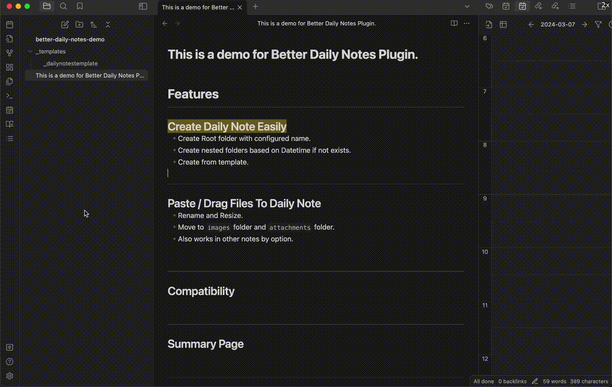
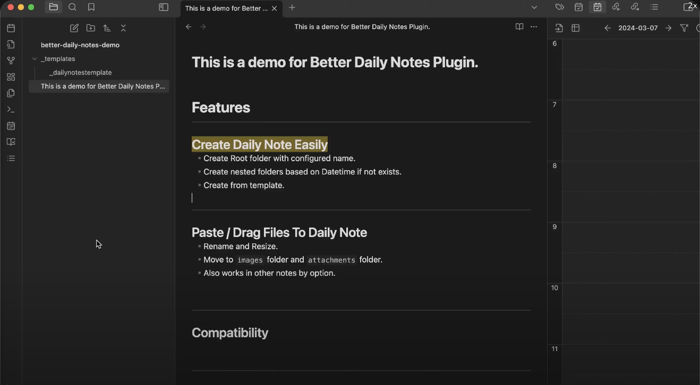
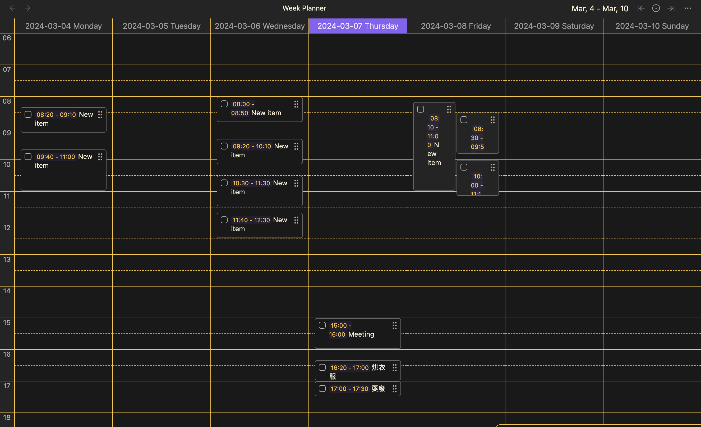
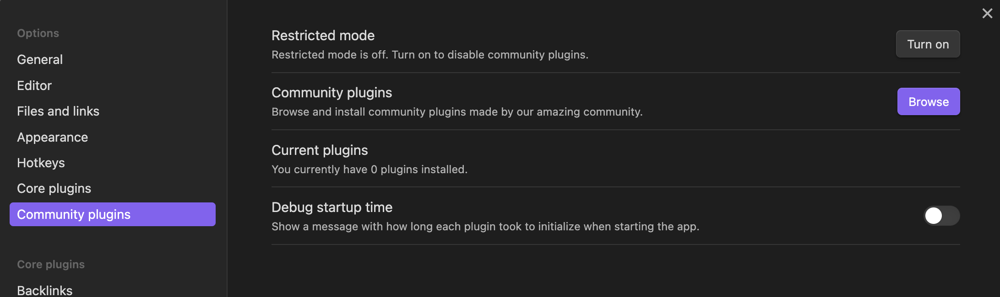
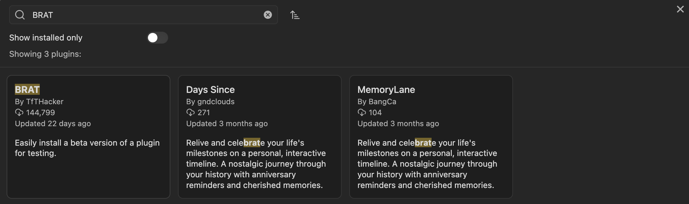
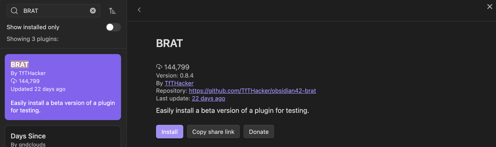
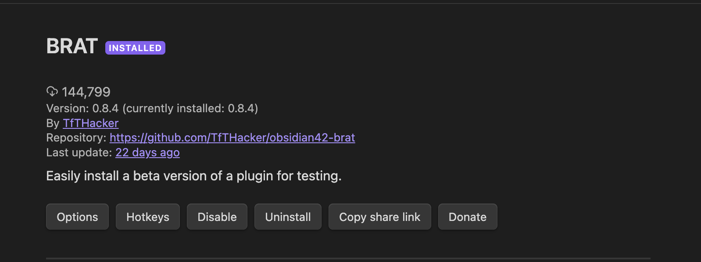
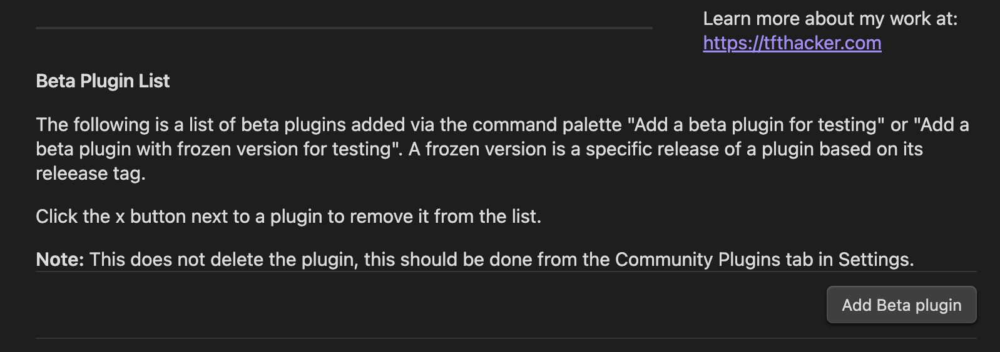
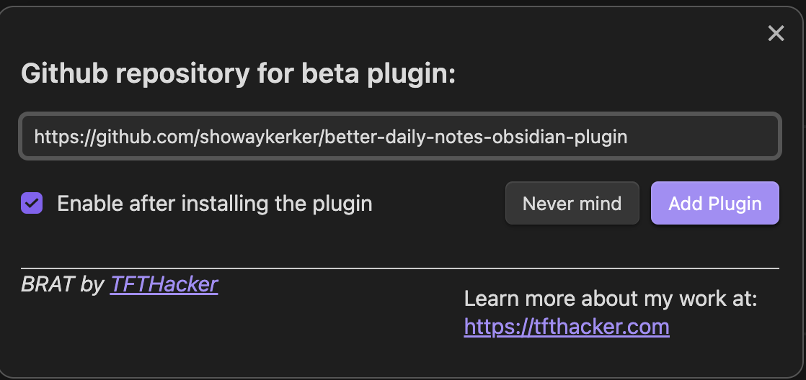

# Better Daily Notes Obsidian Plugin

[English Version](README.md)

透過 **Better Daily Notes** Plugin 改善你的每日筆記體驗。

無縫整合，讓你輕鬆組織和管理你的每日筆記與檔案。

## 功能
- **結構化的每日筆記：** 以結構化的資料夾格式 `[DailyNoteRootDirectory]/[Mon.]/[DateFormat].md` 歸檔每日筆記。
  - 在設定中自定日期格式（`Date Format`）和根目錄（`Root Directory`）。
  - 月份以簡寫表示（如，Jan、Feb、Mar）。
- **檔案管理：** 處理拖曳或貼上到你的筆記中的檔案。
  - 支援的檔案類型為 `images`, `json`, `pdf`, `zip`, `.dill`, `.dmg`, `.kml`, `.pickle`.
  - 處理檔案的時機選項
    - `停用所有處理 Disable All Handling：` 不處理任何檔案。如果你有其他Plugin 如自動圖片上傳等，建議選用此項。
    - `僅在每日筆記中 Only in Daily Notes：` 只處理被拖曳或是貼上到有效每日筆記名稱中的檔案。
    - `在所有檔案中處理 Handle in All Files：` 在包含每日筆記在內的任何筆記上都處理被拖曳或是貼上。
  - 拖曳或貼上的圖片會被存在目前筆記所在文件夾下的`「影像資料夾 Image Subdirectory」`，並且重新命名為 `[筆記檔名]-image#`。
  - 圖片以外被拖曳或貼上的檔案會被存在目前筆記所在文件夾下的`「其他檔案資料夾 Other File Subdirectory」`，並重新命名為 `[筆記檔名]-[原始檔名]`。如果有同名的檔案在同樣的資料夾，則只在筆記中插入該檔案的連結，不新增檔案到Vault裡。
  - 在設置中可以自定圖片和其他檔案的文件夾名稱。
  - 使用 [browser-image-compression](https://github.com/Donaldcwl/browser-image-compression#readme) 壓縮圖片。調整壓縮設定，如最大圖片大小和是否刪除照片的 EXIF。
    - 使用 `Toggle image compression` 指令 取消/恢復 自動的圖片壓縮。
  - 可以使用 markdown 語法將圖片和 PDF 調整為指定寬度。
- **在某個指定時間之前認定為同一天 Assume Same Day Before Hour：**
  - 可以設定在凌晨的某個時間之前會認定仍然是前一天。
- **從模板建立每日筆記：**
  - 手動指定要在建立每日筆記時使用的模板。
- **好用的指令：**
  - 增加一個指令按鈕用來快速打開今天的筆記。
  - 提供命令打開今天、昨天和明天的每日筆記。
- **摘要頁面** (可選用)
  - 新增一個ribbon icon和指令，用於建立/更新每日筆記的摘要頁面。這個頁面在以下情況成立時會自動更新：
    1. 呼叫 `開啟並更新摘要頁面` 指令或ribbon icon時。
    2. 建立每日筆記時。
    3. 移除每日筆記時。
    4. 將每日筆記從某處重命名或重命名到某處時。

### 相容性

這個功能目前仍在**實驗**階段，預設為**啟用**，但如果它做的事情與你預想的不同，請在設置中關掉它（如果能回報那就更好了！）。

#### 已知問題
- 在 MacOS 上，如果您使用 `oneDrive` 作為 vault 的根目錄，您可能無法刪除每日筆記，因為 MacOS 上的 `oneDrive` 有時會奇怪地將已刪除的檔案移動到根目錄。所以此外掛程式仍然會認為該檔案是由其他外掛新增的，將其重新命名並移動到每日筆記資料夾中。請參閱[此討論](https://forum.obsidian.md/t/vault-in-onedrive-deleted-files-are-moved-to-the-onedrive-root/57188)。
- (已在0.3.3版本解決) ~~`Dayjs` 在解析每個字串時會盡力猜測日期，例如，`summary 2` 將被解析為 "2001-02-01"，如果自動建立的檔案被解析為日期，可能會引起問題。下一個版本將通過增加用戶想要解析的格式來修復此問題。~~

#### 測試過的其他plugin

##### [Calendar](https://github.com/liamcain/obsidian-calendar-plugin) :white_check_mark:
|項目|相容性|備註|
|:--:|:--:|:--|
|從日曆建立筆記|:white_check_mark:|會等待1秒，然後重新命名並移動已建立的檔案。|
|點日期打開每日筆記|:grey_exclamation:|大部分日期格式都相容。|

##### [Day Planner](https://github.com/ivan-lednev/obsidian-day-planner) :white_check_mark:
|功能|相容性|備註|
|:--:|:--:|:--|
|從日程計劃建立筆記|:white_check_mark:|等待1秒，然後重新命名並移動已建立的檔案。|
|從日程計劃建立項目|:grey_exclamation:|官方Daily Note外掛程式（和如果有安裝的其他類似每日筆記外掛程式）的日期格式需要與此外掛程式中的日期格式完全相同。如果建立的項目有新增到每日筆記但沒有在timeline上出現，請試著重開App。|
|在日程計劃上顯示項目|:grey_exclamation:|官方Daily Note外掛程式（和如果有安裝的其他類似每日筆記外掛程式）的日期格式需要與此外掛程式中使用的日期格式完全相同。如果建立的項目有新增到每日筆記但沒有在timeline上出現，請試著重開App。|

##### [Rollover Daily TODOs](https://github.com/lumoe/obsidian-rollover-daily-todos) :x:
有計劃在這個plugin裡面時做一樣的功能。

##### 其他
上述列表僅包含我測試和實驗過的外掛程式。如果您對某個外掛程式的相容性感到猶豫，因此不確定是否要使用此外掛程式，請隨時提交issue或在Discord上丟訊息給我。

## 安裝指南

由於這個Plugin目前處於測試版階段，安裝過程需要另外安裝一個名為 [BRAT](obsidian://show-plugin?id=obsidian42-brat) 的Plugin。

你可以在這裡找到 BRAT 的 GitHub [連結](https://github.com/TfTHacker/obsidian42-brat)。

### 步驟

1. 通過以下任一種方式安裝 BRAT：
   - 點擊[此連結](obsidian://show-plugin?id=obsidian42-brat)。
   - 在 Obsidian 中的「社群外掛」選項中搜尋「BRAT」，然後安裝並啟用它。
   
   
   
   

2. 進入 BRAT 的設置頁面，找到「Beta Plugin List」的區塊，然後點擊「Add Beta Plugin」按鈕。
   

3. 輸入這個repository的連結：`https://github.com/showaykerker/better-daily-notes-obsidian-plugin`，然後點擊「Add Plugin」。
   

4. 現在你應該能在設置選單中找到「Better Daily Notes Plugin」的設定頁面了！

### 更新到最新版本
如果有成功的以 BRAT 安裝了這個外掛程式，那只需使用 BRAT 命令進行更新即可。

### 安裝特定版本
如果您想安裝特定版本或預發行版本的此外掛程式，您可以使用 BRAT 的 `Add Beta plugin with frozen version` 功能。
