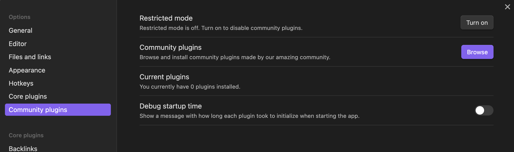

# Better Daily Notes Plugin

[正體中文版](README-zh_tw.md)

Transform your daily note-taking experience with the **Better Daily Notes** Plugin.

Seamlessly integrated, this plugin empowers you to organize and manage your daily notes effortlessly.

## Features

### Features
- **Structured Daily Notes:** Organizes daily notes in a structured folder format `[DailyNoteRootDirectory]/[Mon.]/[DateFormat].md`.
  - Customize the root directory and date format in the settings.
  - Month represented in short form (e.g., Jan, Feb, Mar).
- **Files Management:** Handle files dropped or pasted to your notes.
  - Supported file format: `images`, `json`, `pdf`, `zip`, `.dill`, `.dmg`, `.kml`, `.pickle`
  - Configuration of files handling scenario.
    - `Disable All Handling`: No file handling. If you have another plugin such as automatic image upload, you should disable the handling from this plugin.
    - `Only in Daily Notes`: Only files added to a valid daily-note name will be handled.
    - `Handle in All Files`: Handle all files added to your notes.
  - Images dropped or pasted are saved to a *"image subdirectory"* under the same parent of current note, and renamed to `[CurrentNoteBasename]-image#.[OriginalExt]`
  - Files other than images dropped or pasted are saved to *"other files subdirectory"* under the same parent of current note, and renamed to `[CurrentNoteBasename]-[OriginFileBaseName].[OriginalExt]`. If there exists a file with the same name, this plugin simply adds a link pointing to that file, no file will be added.
  - Customize image and other files' folder name in the settings.
  - Images are compressed using [browser-image-compression](https://github.com/Donaldcwl/browser-image-compression#readme). Adjust compression settings like max image size and EXIF data removal.
    - A command `Toggle image compression` to toggle image compression.
  - Images and pdfs can be resized with markdown syntax to a specified width. Customize resizing width in the settings.
- **Assume Same Day Before Hour:**
  - Considers it the same day before a specified hour after midnight.
- **Create Daily Note From Template:**
  - Manually assign the full path of the template to use when creating a daily note.
- **Convenient Navigation:**
  - Adds a ribbon icon to quickly open today's daily note.
  - Provides commands to open today's, yesterday's, and tomorrow's daily notes.
- **Summary Page** (Optional)
  - Added a ribbon icon and command to create/update the summary page of daily notes. This page will automatically update under the following conditions:
    1. When calling the `Open and update summary page` command or ribbon icon.
    2. When creating a daily note.
    3. When removing a daily note.
    4. When renaming a daily note or renaming it as a daily note. (Note: Moving files also count as renaming)

### Commands
- **Open yesterday's daily note:** Opens yesterday's daily note.
- **Open tomorrow's daily note:** Opens tomorrow's daily note.
- **Toggle image compression:** Toggles image compression settings.
- **Open and update summary page:** Opens a summary page and updates it.

## Installation Guide

As this plugin is currently in beta, the installation process requires an additional plugin called [BRAT](obsidian://show-plugin?id=obsidian42-brat). You can find the GitHub repository for BRAT [here](https://github.com/TfTHacker/obsidian42-brat).

### Steps

1. Install BRAT by following one of these methods:
   - Click [this link](obsidian://show-plugin?id=obsidian42-brat).
   - Navigate to the Community Plugins tab in Obsidian, search for BRAT, and install it. Then, enable it.
   
   
   
   
2. Access the BRAT settings page and locate the `Beta Plugin List` section. Click on the `Add Beta Plugin` button.
  
3. Enter the following repository link: `https://github.com/showaykerker/better-daily-notes-obsidian-plugin`, then click `Add Plugin`.
  
4. You should now find the configuration page for the `Better Daily Notes Plugin` in your Options menu.

## Development
This plugin is built with TypeScript. Here's how to contribute:
1. Clone the repository.
2. Run `npm install` to install dependencies.
3. Make changes in `main.ts` or create new `.ts` files.
4. Compile changes with `$ npm run dev`.
5. Reload Obsidian to load the updated plugin.

## Roadmap of Features
- [ ] Compatibility with other plugins. (Calendar, Day Planner, etc.)
- [ ] Handle create event and editor-drop event for file management.
- [ ] Use svelte in configuration interface.

## Feature Ideas
- [ ] Support of customizing drag and paste behavior.
- [ ] Open daily note on startup.
- [ ] A modal to ask if image compression is required.
- [ ] Create daily note for arbitrary date.
- [ ] Support of month directory custom naming.
- [ ] Compress images and rename file for existing notes.
- [ ] Daily note one line summary by LLM.
- [ ] Generate tags by LLM.
- [ ] Image one line summary by LLM.
- [x] ~~Support of other file types. e.g. `.dill`.~~ (Supported from v0.2.6)
- [x] ~~Commands to toggle image compression.~~ (Added v0.2.5)
- [x] ~~Create daily note with template.~~ (Added v0.2.2)
- [x] ~~Support of installing through [BRAT](https://github.com/TfTHacker/obsidian42-brat).~~
- [x] ~~Support of other file types. e.g. `.pdf`, `.zip`.~~ (Added v0.2.1)

## Known Bugs
- [ ] Compressing very large images may occasionally cause the application to restart.
  > Likely to be resolved with the implementation of the roadmap feature - `Handle create event`.
- [ ] Adding a significant quantity of images at once may result in some not being processed successfully.
  > Likely to be resolved with the implementation of the roadmap feature - `Handle create event`.
- [x] ~~Assume same day before hour logic error.~~
  > ~~Will need to set actual value + 1 for now.~~
- [x] ~~Images will still be resized with markdown syntax in notes that's not wishes to handle images.~~
- [x] ~~Images are not compress to exact wished size.~~
