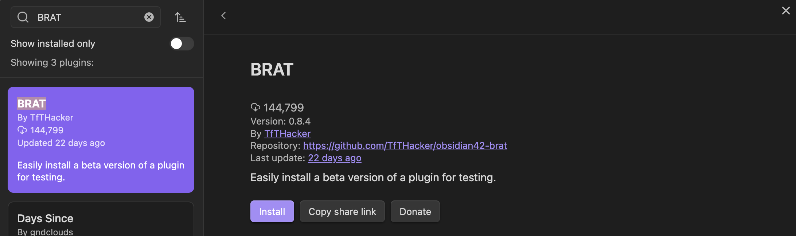
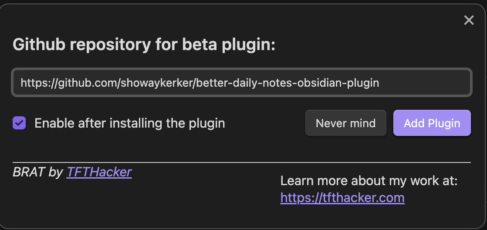

# 安裝指南

由於這個Plugin目前處於測試版階段，安裝過程需要另外安裝一個名為 [BRAT](obsidian://show-plugin?id=obsidian42-brat) 的Plugin。

你可以在這裡找到 BRAT 的 GitHub [連結](https://github.com/TfTHacker/obsidian42-brat)。

### 步驟

1. 通過以下任一種方式安裝 BRAT：
   - 點擊[此連結](obsidian://show-plugin?id=obsidian42-brat)。
   - 在 Obsidian 中的「社群插件」選項中搜尋「BRAT」，然後安裝並啟用它。
   
   
   
   

2. 進入 BRAT 的設置頁面，找到「Beta Plugin List」的區塊，然後點擊「Add Beta Plugin」按鈕。
   

3. 輸入這個repository的連結：`https://github.com/showaykerker/better-daily-notes-obsidian-plugin`，然後點擊「Add Plugin」。
   

4. 現在你應該能在設置選單中找到「Better Daily Notes Plugin」的設定頁面了！
